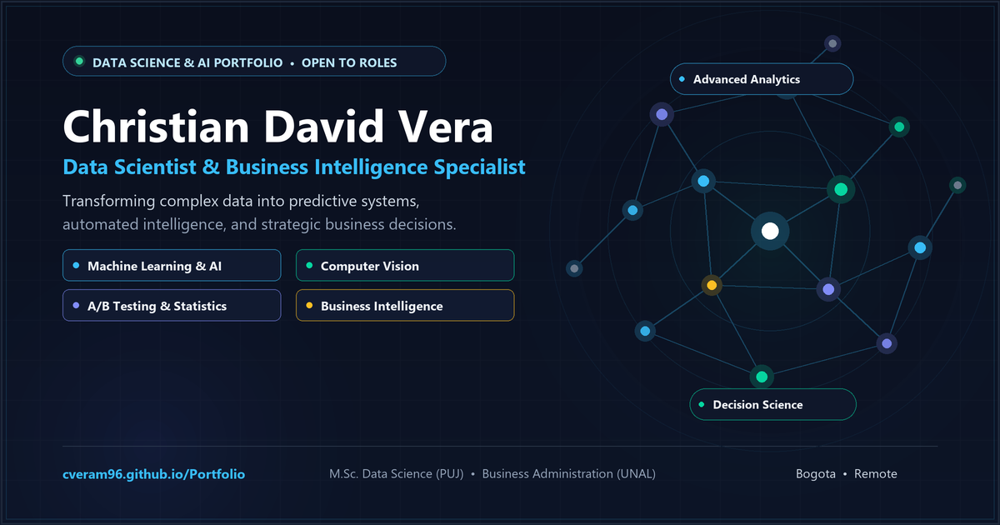

# Christian David Vera Mendivelso
### Data Scientist & Business Intelligence Specialist
**M.Sc. in Data Science (Pontificia Universidad Javeriana) | Business Administration (Universidad Nacional de Colombia)**  
*Bogota, Colombia*

  

---

### Tech Stack & Core Competencies

---

## About Me

I am a **Data Scientist and Analytics Specialist** with a dual profile: **advanced quantitative and technical expertise** through a Master's in Data Science (*Pontificia Universidad Javeriana*), backed by strong **strategic and financial business acumen** (*Universidad Nacional de Colombia*).

With experience in financial institutions (*Cooptenjo*) and freelance analytics consulting, I specialize in:
- **Computer Vision & Edge Surveillance:** Deploying deep learning systems for automated visual tracking and detection.
- **Digital Experimentation & Causal Inference:** Designing statistical A/B tests with variance reduction techniques (CUPED) and power analysis to guide product decisions.
- **Predictive Modeling & Machine Learning:** End-to-end classification, regression, and customer churn models tied directly to business retention economics.
- **Executive Business Intelligence:** Designing automated ETL pipelines and interactive Power BI / SQL dashboards for decision-makers.

**Explore the live interactive portfolio at [cveram96.github.io/Portfolio](https://cveram96.github.io/Portfolio/)**

---

## Featured Projects

### 1. [ParkVision AI - Real-Time Smart Parking Monitoring System](https://cveram96.github.io/Portfolio/parkvision.html)
> **Domain:** Computer Vision, Deep Learning, Real-Time Edge Analytics  
> **Technologies:** `Python 3.10+`, `Ultralytics YOLOv8`, `ByteTrack`, `FastAPI`, `WebSockets`, `OpenCV`, `SQLite3`, `DirectML (AMD) / CUDA (NVIDIA)`

- **Business Problem:** Parking search inefficiency causes urban congestion and carbon emissions. Physical ground sensor installations are cost-prohibitive.
- **Solution:** Production-grade Computer Vision web application processing live video streams (local files, USB webcams, or networked RTSP IP cameras) using YOLOv8 multi-class vehicle detection, ByteTrack spatial persistence, and vector polygon intersection algorithms.
- **Key Features:**
  - Real-time slot occupancy tracking (Available / Occupied state machine with sub-second latency).
  - Interactive web canvas for 4-corner perspective correction and custom parking bay calibration.
  - Multi-hardware acceleration for AMD GPUs (DirectML) and NVIDIA GPUs (CUDA).
  - Persistent SQLite logging (`parking.db`) and CSV/Excel exports for temporal occupancy and dwell time analysis.
- **[Read Project Documentation](https://cveram96.github.io/Portfolio/parkvision.html)** | **[Source Code](https://github.com/cveram96/Portfolio/tree/main/Files/parking_monitor)**

---

### 2. [Digital Experimentation Platform & CUPED](https://cveram96.github.io/Portfolio/ab_testing.html)
> **Domain:** Product Analytics, Hypothesis Testing, Advanced Causal Inference  
> **Technologies:** `Python`, `SciPy.stats`, `Statsmodels`, `Pandas`, `Matplotlib`, `Seaborn`

- **Business Problem:** Companies risk losing revenue when shipping unvalidated product changes or running underpowered A/B tests with noisy metrics.
- **Solution:** Comprehensive experimentation platform covering statistical test design, minimum detectable effect (MDE) sizing, and variance reduction using **CUPED** (Controlled-experiment using Pre-Experiment Data).
- **Key Results:**
  - Achieved **-42.8% metric variance reduction** and a **-24.4% narrower 95% Confidence Interval** for Average Treatment Effect (ATE).
  - Reduced required sample size by **-42.7%** to reach 80% statistical power ($\alpha = 0.05$), dramatically shortening experiment duration.
  - Applied hypothesis testing and causal inference to real-world e-commerce data (Udacity A/B test with 290,584 users).
- **[Read Project Documentation](https://cveram96.github.io/Portfolio/ab_testing.html)** | **[Experiments Codebase](https://github.com/cveram96/Portfolio/tree/main/experimentation-platform/experiments)**

---

### 3. [Customer Churn Prevention & Retention Economics](https://cveram96.github.io/Portfolio/churn.html)
> **Domain:** Supervised Machine Learning, Customer Retention, Model Explainability  
> **Technologies:** `Python`, `Scikit-Learn`, `Imbalanced-Learn`, `SHAP`, `Pandas`, `Seaborn`

- **Business Problem:** Reducing customer attrition in telecom, where acquiring a new user costs 5-7x more than retaining an existing one.
- **Solution:** End-to-end predictive pipeline comparing Random Forest, Multi-Layer Perceptrons (MLP), and Histogram Gradient Boosting with class balancing strategies (SMOTE, SMOTEENN, ADASYN, RandomUnderSampler).
- **Key Innovations:**
  - **SHAP Explainability:** Deployed `shap.TreeExplainer` beeswarm plots revealing that month-to-month contracts and short tenure are the primary drivers of attrition.
  - **Champion Model:** Random Forest with SMOTEENN achieves **77.7% Recall** and **0.633 F1-score**, maximizing churn capture with minimal false alarms.
  - **Business Impact:** Decision-threshold calibration translating prediction probabilities into an actionable customer retention tier ($ \ge 80\% $ risk).
- **[Read Project Documentation](https://cveram96.github.io/Portfolio/churn.html)** | **[Jupyter Notebook](https://github.com/cveram96/Portfolio/blob/main/Files/Proyecto%20Churn.ipynb)**

---

## Business Intelligence & Core Analytics

| Project | Tech Stack | Business Focus | Link |
| :--- | :--- | :--- | :---: |
| **Power BI Netflix Catalog Analytics** | Power BI, DAX, Power Query | Interactive executive dashboard on global entertainment catalog distribution, genre popularity, and maturity ratings. | [View Dashboard](https://cveram96.github.io/Portfolio/netflix.html) |
| **SQL Northwind Commercial Analytics** | SQLite, Python, Plotly, Mermaid | 13-table relational schema architecture, normalized ERD, revenue metrics with line-item discounts, and RFM cohort queries. | [Explore Queries](https://cveram96.github.io/Portfolio/SQL_Northwind.html) |
| **Time Series Demand Forecasting (SARIMA)** | Python, Statsmodels, ARIMA | Forecasting airline passenger demand with seasonal decomposition, ADF stationarity tests, and SARIMA achieving 3.68% MAPE. | [View Forecast](https://cveram96.github.io/Portfolio/ARIMA.html) |
| **Customer Segmentation (K-Means & RFM)** | Python, Scikit-Learn, RFM | Behavioral clustering pipeline (`np.log1p` + `MinMaxScaler`) discovering 3 distinct customer personas for targeted marketing. | [View Clusters](https://cveram96.github.io/Portfolio/segmentacion.html) |
| **California Housing Price Regression** | Python, Scikit-Learn, Statsmodels | Multivariate linear regression ($R^2 = 0.636$), feature elasticity, and Gauss-Markov diagnostic validation. | [View Model](https://cveram96.github.io/Portfolio/RLM.html) |

---

## Technical Skills Summary

- **Programming Languages:** Python (3.10+), SQL (PostgreSQL, SQLite), DAX.
- **Machine Learning & AI:** Supervised Learning (Classification, Regression), Unsupervised Learning (K-Means, PCA), Computer Vision (YOLOv8, OpenCV, ByteTrack), Time Series (ARIMA / SARIMA), Model Explainability (SHAP).
- **Statistics & Experimentation:** A/B Testing, CUPED (Variance Reduction), Hypothesis Testing (p-values, confidence intervals), Power & Sample Size Analysis (MDE), Causal Inference.
- **Business Intelligence & Data Engineering:** Power BI, Tableau, Power Query, ETL Pipelines, FastAPI, WebSockets, Relational Modeling.
- **Tools & Environments:** Git/GitHub, Jupyter, DirectML, CUDA, VS Code, Excel (Advanced).

---

## Contact & Links

- **Email:** [verachristian4@gmail.com](mailto:verachristian4@gmail.com)
- **LinkedIn:** [Christian David Vera Mendivelso](https://www.linkedin.com/in/christian-david-vera-mendivelso-659524210/)
- **Phone / WhatsApp:** [+57 321 379 7876](https://wa.me/573213797876)
- **Location:** Bogota, Colombia *(Open to Remote, Hybrid, and Relocation)*
- **Live Portfolio:** [https://cveram96.github.io/Portfolio/](https://cveram96.github.io/Portfolio/)
